# Jenkins Shared Library & Parameterised Pipelines

This project is a hands-on lab that covers two common real-world Jenkins skills:

1. **Building a reusable Jenkins Shared Library** so multiple pipelines can share the same CI/CD code instead of copy-pasting it.
2. **Creating a parameterised pipeline** that can deploy to different environments (Dev, QA, Staging, Production) using a single Jenkinsfile.

---

## Architecture
 
```
jenkins-shared-library (repo1)
        │
        │  @Library('jenkins-shared-library') _
        ▼
jenkins-shared-library-multi-env-pipeline (repo2)
        ├── Jenkinsfile   (calls the shared library steps)
        └── maven-app/    (generated via mvn archetype:generate)
```
 
---

## Prerequisites

Before starting, make sure you have:

- A running Jenkins server (local or on a server/EC2 instance)
- A GitHub account (to host the shared library and sample project repos)
- Docker installed on the Jenkins agent/node (for the build/push steps)
- Basic familiarity with Git and Jenkins pipeline syntax (helpful but not required)
- Create ECR repo in the region you have selected.

---

## Repositories
 
| Repo | Purpose |
|---|---|
| [`jenkins-shared-library`](https://github.com/sinsha-c/jenkins-shared-library) | The reusable shared library (repo1) |
| [`jenkins-shared-library-multi-env-pipeline`](https://github.com/sinsha-c/jenkins-shared-library-multi-env-pipeline) | Consumer pipeline + simple Maven app (repo2) |


## Task 1: Reusable Jenkins Shared Library

### What is a Shared Library?

Think of a Shared Library as a "toolbox" of common pipeline functions (like Git checkout, build, and Docker push) that you write **once** and reuse in **any number of Jenkinsfiles**. This avoids duplicating the same pipeline code in every project.

### Step 1: Create the Shared Library Repository

1. Create a new GitHub repository, for example `jenkins-shared-library`.
2. Inside it, create the following folder structure. This is the standard layout Jenkins expects:

```
jenkins-shared-library/
└── vars/
    ├── gitCheckout.groovy
    ├── mavenBuild.groovy
    ├── dockerBuildImage.groovy
    └── dockerPushImage.groovy
```

> The `vars/` folder holds "global variables" — each `.groovy` file becomes a callable function you can use directly in a Jenkinsfile.

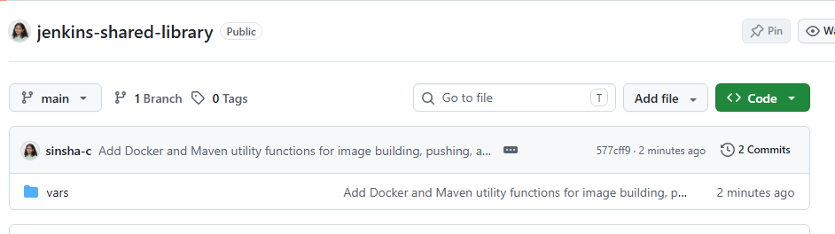

### Step 2: Write the Reusable Functions

Each file in `vars/` defines one reusable step. Here are simple examples:
 
**`vars/gitCheckout.groovy`**
```groovy
def call(String repoUrl, String branch = 'main') {
    echo "Checking out ${branch} from ${repoUrl}"
    git branch: branch, url: repoUrl
}
```
 
**`vars/mavenBuild.groovy`** (kept simple for a beginner)
```groovy
def call() {
    echo "Building Maven project..."
    sh 'mvn clean package'
}
```
 
**`vars/dockerBuildImage.groovy`**
```groovy
def call(String imageName, String imageTag = 'latest') {
    echo "Building Docker image: ${imageName}:${imageTag}"
    sh "docker build -t ${imageName}:${imageTag} ."
}
```
`imageName` (e.g. `'maven-app'`) is just the **local** name Docker gives the image on the Jenkins agent — it doesn't need to match anything in ECR yet. That happens in the push step below.
 
**`vars/dockerPushImage.groovy`**
```groovy
def call(String localImageName, String ecrRepoUrl, String imageTag = 'latest', String awsRegion = 'ap-south-1') {
    echo "Pushing Docker image to ECR: ${ecrRepoUrl}:${imageTag}"
    sh """
        aws ecr get-login-password --region ${awsRegion} | docker login --username AWS --password-stdin ${ecrRepoUrl}
        docker tag ${localImageName}:${imageTag} ${ecrRepoUrl}:${imageTag}
        docker push ${ecrRepoUrl}:${imageTag}
    """
}
```

`localImageName` must match the `imageName` used in `dockerBuild()` — that's the image `docker tag` retags (renames) to the full ECR repo URL before pushing, since ECR only accepts images pushed under its own repo URL.
> Uses the AWS CLI already configured on the Jenkins agent (or an IAM instance role) to authenticate to ECR — no separate Jenkins credentials needed, just AWS permissions for `ecr:GetAuthorizationToken`, `ecr:BatchCheckLayerAvailability`, and `ecr:PutImage`.

Commit and push these files to your **repo1** `jenkins-shared-library` repository.

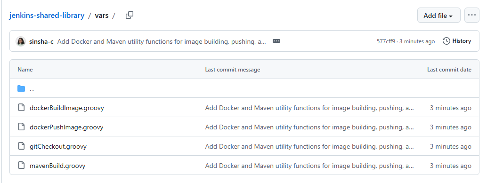

### Step 3: Configure the Library in Jenkins

1. Go to **Manage Jenkins → System**.
2. Scroll down to **Global Pipeline Libraries**.
3. Click **Add** and fill in:
   - **Name**: `jenkins-shared-library` (this is the name you'll reference with `@Library`)
   - **Default version**: `main` (your branch name)
   - **Retrieval method**: Modern SCM → Git
   - **Project Repository**: the URL of your shared library repo
4. Click **Save**.

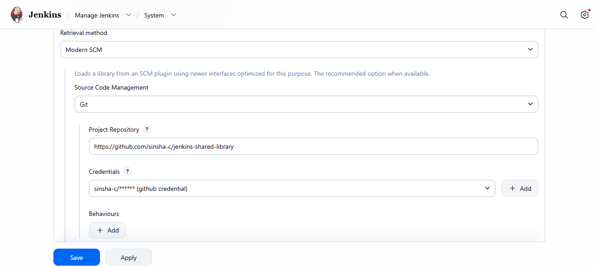

### Step 4: Generate a basic Maven application

Inside your ec2-unbuntu create a folder and you can generate a basic Maven application with:

```bash
mvn archetype:generate \
  -DgroupId=com.example \
  -DartifactId=demo-app \
  -DarchetypeArtifactId=maven-archetype-quickstart \
  -DarchetypeVersion=1.5 \
  -DinteractiveMode=false
```

Then move the generated pom.xml and src into the repository 2 root if needed.


### Step 5: Use the Library in a Jenkinsfile

In your actual project repository (here repo2), create a `Jenkinsfile` that pulls in the shared library with `@Library` and calls the reusable functions:

```groovy
@Library('jenkins-shared-library') _

pipeline {
    agent any

    environment {
        AWS_ACCOUNT_ID = credentials('aws-account-id')
        AWS_REGION     = 'ap-south-1'
    }

    stages {
        stage('Checkout') {
            steps {
                gitCheckout(env.GIT_URL)
            }
        }
        stage('Build') {
            steps {
                mavenBuild()
            }
        }
        stage('Docker Build') {
            steps {
                dockerBuildImage('maven-app', "v${BUILD_NUMBER}")
            }
        }
        stage('Docker Push') {
            steps {
                dockerPushImage("${AWS_ACCOUNT_ID}.dkr.ecr.${AWS_REGION}.amazonaws.com/maven-app", "v${BUILD_NUMBER}")
            }
        }
    }
}
```

> The `@Library('jenkins-shared-library') _` line at the top tells Jenkins to load the library you configured in Step 3. The underscore `_` is required syntax when you're not importing a specific class.
> `AWS_ACCOUNT_ID` is pulled from a Jenkins **Secret text** credential (ID `aws-account-id`) instead of being hardcoded — set this up under **Manage Jenkins → Credentials** before running the pipeline. 
> 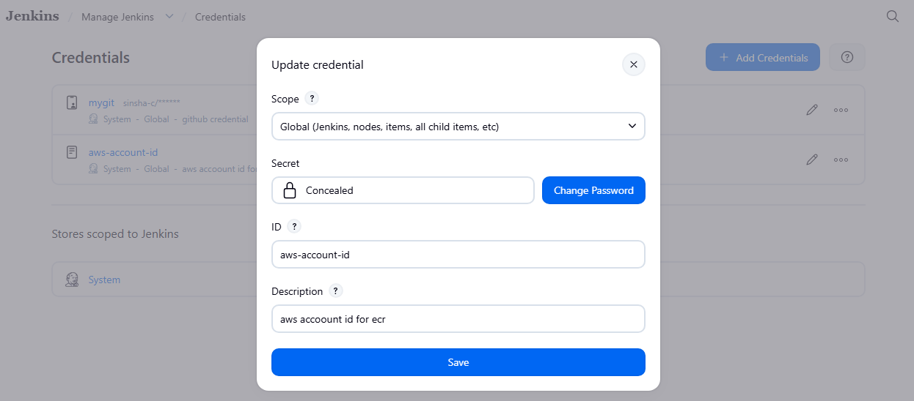

> Also make sure an ECR repository named `maven-app` already exists in the configured region.
> 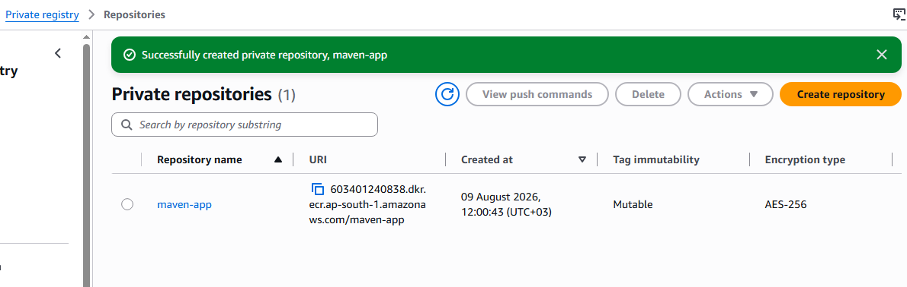

>  `BUILD_NUMBER` is another Jenkins built-in variable — it auto-increments on every run (1, 2, 3…), so each build produces a uniquely tagged image (`v1`, `v2`, `v3`…) instead of overwriting the same `v1` tag every time.

### Step 6: Create Dockerfile 

**Does `dockerBuild()` need a Dockerfile?** Yes — `docker build -t ... .` (the `.` means "build context = current directory") always looks for a file literally named `Dockerfile` in that directory. It's not generated by `mvn archetype:generate`, so a simple one needs to be added manually to the `maven-app/` 
folder.

```dockerfile
FROM eclipse-temurin:17-jre
COPY target/*.jar app.jar
ENTRYPOINT ["java", "-jar", "app.jar"]
```

This copies the `.jar` produced by `mavenBuild()`'s `mvn clean package` step into the image — keep it this simple since the focus of the lab is the pipeline, not the app. Commit the Dockerfile to repo2.


### Step 7: Prove It Works Across Multiple Projects

To demonstrate reusability, use the **same shared library** in a second, different project repository — just repeat Step 4 with a different `Jenkinsfile` (pointing to a different app repo). Both pipelines should build successfully, calling the exact same underlying functions without any duplicated code.

*Jenkins console output showing the pipeline running through Checkout → Build → Docker Build → Docker Push stages using the shared library steps, ending in `Finished: SUCCESS`.*

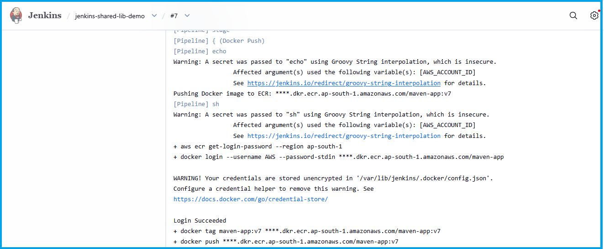
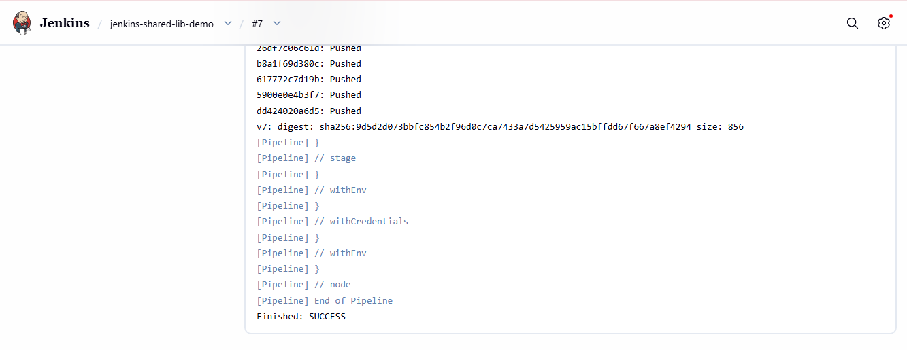

*ECR repository — pushed image*
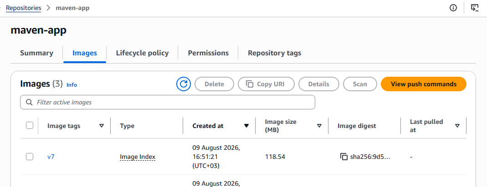

---
 
## Task 2: Parameterised Pipeline for Multi-Environment Deployments
 
This is implemented in **repo2**'s `Jenkinsfile`, on top of the shared library setup above.
 
### Step 1 — Add the `parameters` block
 
```groovy
@Library('jenkins-shared-library') _
 
pipeline {
    agent any
 
    environment {
        AWS_ACCOUNT_ID = credentials('aws-account-id')
        AWS_REGION     = 'ap-south-1'
    }
 
    parameters {
        choice(
            name: 'ENVIRONMENT',
            choices: ['Dev', 'QA', 'Staging', 'Production'],
            description: 'Select the environment to deploy to'
        )
    }
 
    stages {
        stage('Show Parameters') {
            steps {
                echo "Selected Environment: ${params.ENVIRONMENT}"
            }
        }
        stage('Checkout') {
            steps {
                gitCheckout(env.GIT_URL)
            }
        }
        stage('Build') {
            steps {
                mavenBuild()
            }
        }
        stage('Docker Build') {
            steps {
                dockerBuild('maven-app', "${params.ENVIRONMENT.toLowerCase()}")
            }
        }
        stage('Docker Push') {
            steps {
                dockerPush('maven-app', "${AWS_ACCOUNT_ID}.dkr.ecr.${AWS_REGION}.amazonaws.com/maven-app", "${params.ENVIRONMENT.toLowerCase()}")
            }
        }
        stage('Deploy') {
            steps {
                echo "Deploying maven-app to ${params.ENVIRONMENT} environment..."
            }
        }
    }
}
```
 
- `choice()` creates the environment dropdown with the 4 options.
- `params.ENVIRONMENT` reads the selected value anywhere in the pipeline.
- The **Show Parameters** stage prints the selection directly to console output.

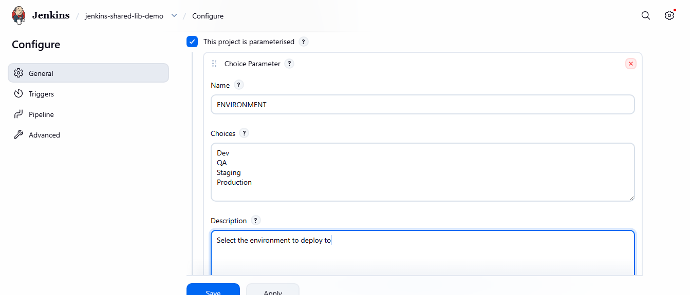

### Step 2 — First-run behaviour
 
On the very first run of a new pipeline job, Jenkins doesn't yet know about the `parameters` block, so it runs once with no parameters shown. After that first scan, the job page shows **Build with Parameters**, and every subsequent run lets you pick the environment from the dropdown.
 
*The "Build with Parameters" screen showing the ENVIRONMENT choice dropdown (Dev/QA/Staging/Production).*

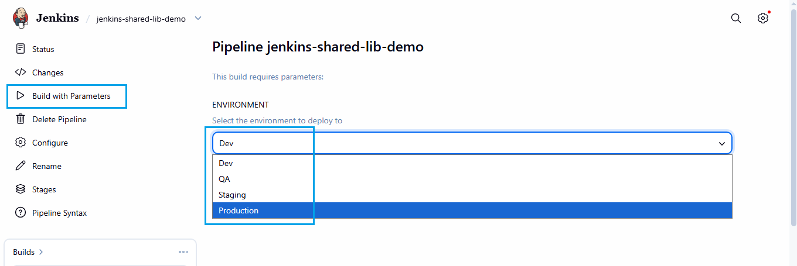

### Step 3 — Verify parameter output in console
 
After triggering a build with a chosen environment (e.g. `QA`), the console output confirms the selection and carries it through the Docker build/push stages (e.g. image tagged `qa`).
 
*Jenkins console log showing "Selected Environment: Production" and the environment-tagged Docker image build/push.*

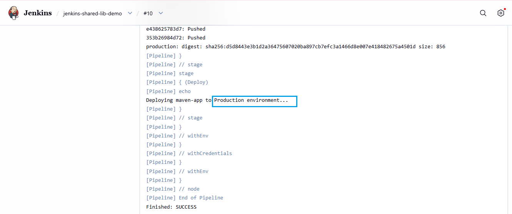

*Image pushes to ECR with tag selected environment (here Production).*

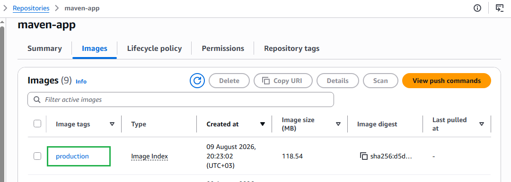

---
 
## 🧰 Maven App
 
A minimal Maven project generated with:
 
```bash
mvn archetype:generate
```
 
Kept intentionally simple (a basic `mvn clean package` build) so the focus of this lab stays on the shared library and pipeline parameterisation, not the Java application itself.
 
---

## Key Takeaways

- Shared Libraries eliminate duplicate pipeline code across projects — write once, use everywhere.
- The `@Library` annotation is how a Jenkinsfile "imports" the shared library.
- Parameterised pipelines let one Jenkinsfile serve multiple environments, avoiding pipeline sprawl.
- Always echo/log selected parameters early in the pipeline — it makes debugging and auditing much easier.

---

## Notes

- Replace all placeholder repo URLs (`https://github.com/your-username/...`) with your actual repository links.
- Screenshot filenames above are placeholders — replace them with your actual captured screenshots, keeping the same filenames or updating the `` paths accordingly.
